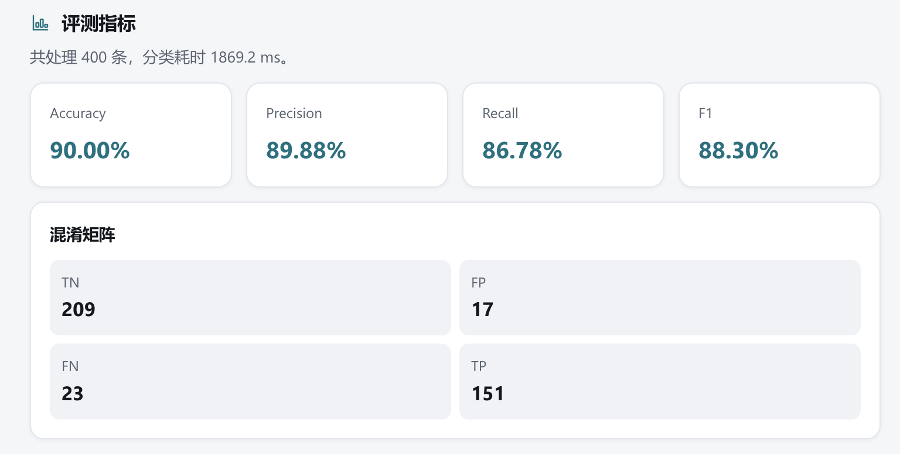

# 可解释的谣言检测系统

本项目是《人工智能导论》课程大作业“可解释的谣言检测”的工程实现。系统输入推文文本和事件编号，输出二分类检测结果、概率、相似案例和可读解释。

分类标签定义如下：

- `0`：非谣言
- `1`：谣言

项目以 `data/train.csv` 作为唯一训练数据来源。训练时**为每个事件独立训练一个 RoBERTa 分类模型**（7 个事件 → 7 个模型），训练时从各事件数据内部切分 90% 训练集和 10% 内部验证集。训练完成后自动从 `data/val.csv` 搜索每个事件的最优判定阈值。`data/val.csv` 只用于阈值选择，不参与模型权重训练。

所有预测都必须提供事件编号。事件编号固定为 `0` 到 `6`，分别对应以下事件：

- `0`：Gurlitt 艺术收藏事件。
- `1`：Ferguson 与 Michael Brown 事件。
- `2`：Michael Essien 与 Ebola 事件。
- `3`：Prince 多伦多演出事件。
- `4`：Germanwings 航班坠机事件。
- `5`：悉尼咖啡馆人质事件。
- `6`：渥太华枪击事件。

批量 CSV 字段必须严格等于 `id`、`text`、`label`、`event` 四列且均不能为空。缺少字段或存在其他字段时会拒绝分析。

## 清洗算法

清洗逻辑位于 `src/data/preprocess.py` 和 `src/data/dataset.py`。训练、验证、WebUI 和 CLI 会使用一致的文本归一化流程。

当前处理步骤如下：

- 对完全相同的样本，仅保留一条
- 对原始文本完全相同但标签冲突的训练样本删除全部冲突项
- 对主体文本相同、URL 不同且标签相同的训练样本仅保留一条
- 对主体文本相同、URL 不同但标签不同的训练样本不做自动处理
- 还原 HTML 转义字符
- 删除推文开头的 `RT` 标记
- 将 图片URL 归一为 `IMAGEURL` ，其余归一为 `HTTPURL`
- 将 emoji 转为英文语义词
- 将 emoji 语义词中的下划线转为空格
- 合并多余空白
- @mention 保留媒体/官方/机构账号，其余账号统一为 @USER
- #hashtag 统一 “去掉# 并按照驼峰拆词” ， 一些拆分之后无意义的词单独维护了一个字典，排除在拆词操作之外

## 训练算法

训练入口位于 `src/training/trainer.py`。

算法结构如下：

- 基础模型使用 `cardiffnlp/twitter-roberta-base`。每个事件独立训练一个分类模型，保存到 `models/outputs/event_0/` ~ `event_6/`。
- 每个事件模型额外训练一个 TF-IDF Logistic Regression 模型，输入格式为 `__event_事件编号__ 文本内容`。
- 推理时融合 RoBERTa 正类概率和 TF-IDF 正类概率，融合权重和判定阈值在 `data/val.csv` 上自动搜索最优值。
- 单类事件（Event 2、3）不使用 TF-IDF 融合，直接用 BERT 输出。
- 推理时自动检测分事件模型，按事件编号路由到对应模型。

训练策略如下：

- 每个事件独立训练，按事件内标签比例做分层切分（单类事件不做分层）。
- 使用 weighted cross entropy 缓解类别不平衡。
- 使用 label smoothing 降低过度自信。
- 使用 dropout 覆盖、weight decay 和 gradient clipping 控制过拟合。
- 使用梯度累积和混合精度适配本地 GPU。
- 使用差分学习率训练（head_learning_rate、base_learning_rate、layerwise_lr_decay）。
- 每轮在内部验证集上计算指标，训练结束后从 `data/val.csv` 自动搜索每个事件的最优融合权重和判定阈值。

`training_metadata.json` 会记录最佳 epoch、最佳阈值、融合权重、训练配置、内部验证指标和数据切分信息。

## 指标和评判标准

系统显示并保存以下分类指标：

- Accuracy：所有样本中预测正确的比例。
- Precision：预测为谣言的样本中真实为谣言的比例。
- Recall：真实谣言样本中被识别为谣言的比例。
- F1：Precision 和 Recall 的调和平均。
- Confusion Matrix：TP、FP、FN、TN 四类计数。
  - **TP (True Positive)**：真实为谣言，模型预测为谣言。
  - **FP (False Positive)**：真实为非谣言，模型预测为谣言。
  - **FN (False Negative)**：真实为谣言，模型预测为非谣言。
  - **TN (True Negative)**：真实为非谣言，模型预测为非谣言。

评测时建议以 `val.csv` 作为未知集。`train.csv` 内部验证集只用于训练过程中的模型选择，不能代表最终泛化能力。

## 评测结果

最新未知集评测结果：



## 环境配置与使用方式

建议使用 Python 3.11。训练建议使用支持 CUDA 的 NVIDIA GPU。`requirements.txt` 不包含 PyTorch 环境，PyTorch 需要根据本机系统、CUDA 版本或 CPU 环境单独安装。

### 演示环境

WebUI 用于演示单条文本检测、批量 CSV 分析、相似案例检索和可读解释生成。演示环境建议使用 Python 3.11，并需要安装项目依赖和与本机环境匹配的 PyTorch。

```bash
pip install -r requirements.txt
```

下载已经训练好的模型到 `models/outputs/` 目录：

```bash
python scripts/download_models.py
```

启动 WebUI：

```bash
python -m src.webui.main
```

### 训练环境

训练流程在 CLI 中进行。先安装项目依赖：

```bash
pip install -r requirements.txt
```

然后按本机环境安装 PyTorch。安装命令请以 PyTorch 官方安装页面为准。

下载 RoBERTa 到本地预训练模型目录：

```bash
python -c "from huggingface_hub import snapshot_download; snapshot_download(repo_id='cardiffnlp/twitter-roberta-base', local_dir='models/pretrained_roberta')"
```

训练分类模型（默认为所有事件独立训练）：

```bash
python -m src.cli.train --config configs/default.yaml
```

如需只训练单个事件：

```bash
python -m src.cli.train --config configs/default.yaml --event 0
```

在未知集 `val.csv` 上评测：

```bash
python -m src.cli.evaluate --config configs/default.yaml
```

单条文本预测，事件编号必须显式指定，取值为 `0` 到 `6`：

```bash
python -m src.cli.predict --config configs/default.yaml --text "input tweet here" --event 1 --no-explain
```

批量评测，CSV 必须包含 `id`、`text`、`label`、`event` 四列：

```bash
python -m src.cli.batch --config configs/default.yaml --csv data/val.csv --output batch_report.json
```
